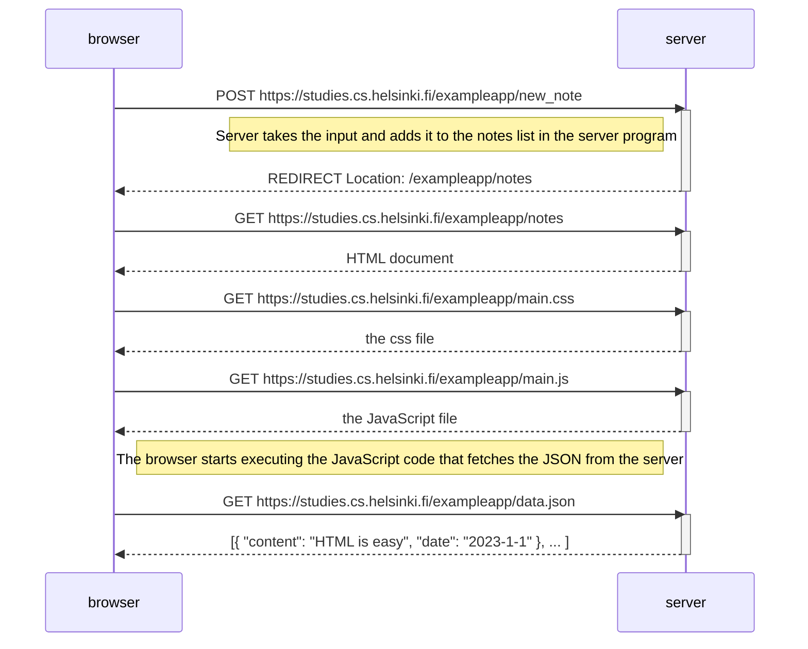
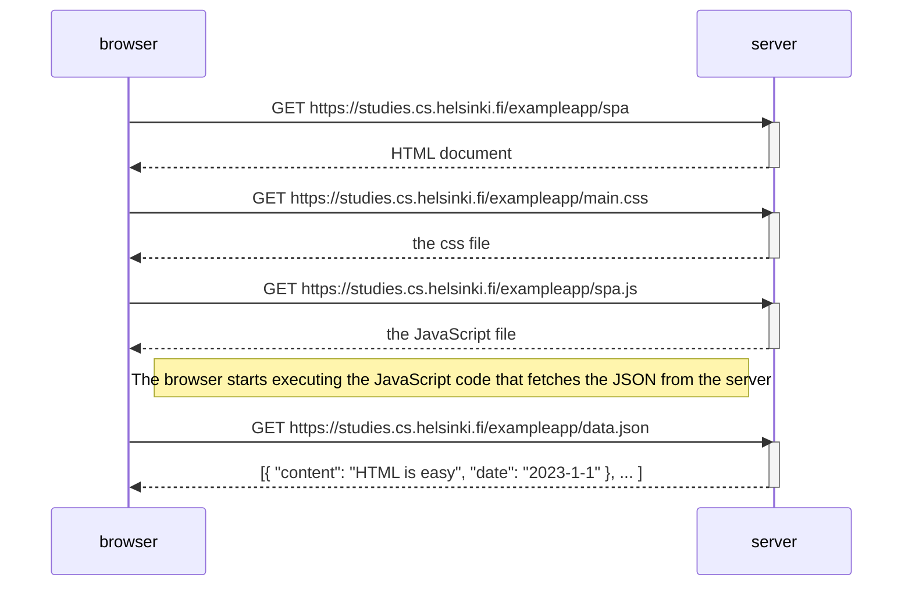
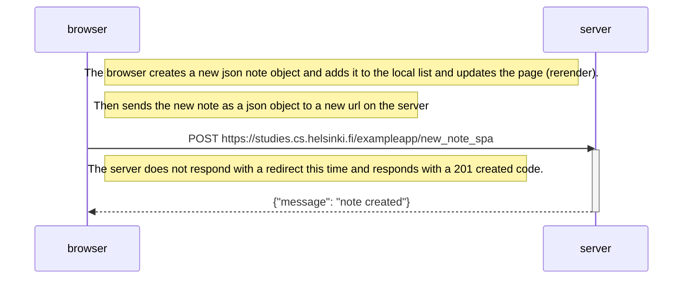

# Part 0 Exercise Solutions

## 0.4 New note diagram

---

## 0.5 Single page app diagram

---
## 0.6 New note in Single page app diagram

===============x End of exercise
 
 >Finished by: **Vinnie**

 

